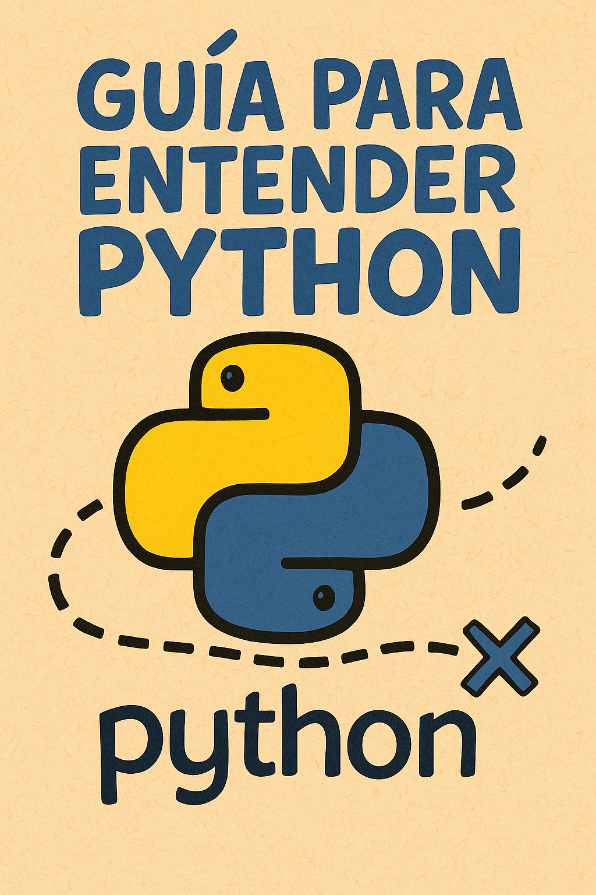

# 🐍 Guía de Instalación y Configuración



## 🎯 Instalación Rápida

### Para Windows

1. **Descarga Python**
   - Ve a [python.org](https://python.org/downloads)
   - Descarga la versión más reciente
   - **IMPORTANTE**: Marca "Add Python to PATH" durante la instalación

2. **Verifica la instalación**
   ```cmd
   python --version
   ```

3. **Descarga el curso**
   - Descarga y descomprime los archivos del curso
   - O clona el repositorio si usas Git

### Para macOS

```bash
# Usando Homebrew (recomendado)
brew install python

# Verificar instalación
python3 --version
```

### Para Linux (Ubuntu/Debian)

```bash
sudo apt update
sudo apt install python3 python3-pip

# Verificar instalación
python3 --version
```

## 📁 Estructura del Curso

```
start-python/
├── README.md                     # Índice principal
├── 01-preparacion/              # Configuración inicial
├── 02-fundamentos/              # Variables, operadores
├── 03-control-flujo/            # Condicionales, bucles
├── 04-estructuras-datos/        # Listas, diccionarios
├── 05-archivos/                 # Manejo de archivos
├── 06-proyectos/                # Proyectos prácticos
├── ejercicios/                  # Ejercicios adicionales
└── recursos/                    # Material de apoyo
```

## 🚀 Cómo Empezar

1. **Lee el README principal**
   ```
   start-python/README.md
   ```

2. **Empieza con la preparación**
   ```
   01-preparacion/instalacion.md
   ```

3. **Crea tu carpeta de trabajo**
   ```bash
   mkdir mi-curso-python
   cd mi-curso-python
   ```

4. **Ejecuta tu primer programa**
   ```python
   # Crea archivo: hola.py
   print("¡Hola Python!")
   ```
   
   ```bash
   python hola.py
   ```

## ⚙️ Configuración del Editor

### Visual Studio Code (Recomendado)

1. **Instala VS Code**
   - Descarga desde [code.visualstudio.com](https://code.visualstudio.com)

2. **Instala la extensión de Python**
   - Abre VS Code
   - Ve a Extensions (Ctrl+Shift+X)
   - Busca "Python" (Microsoft)
   - Instala la extensión

3. **Configura el intérprete**
   - Abre un archivo .py
   - Presiona Ctrl+Shift+P
   - Escribe "Python: Select Interpreter"
   - Selecciona tu versión de Python

### Configuración básica de VS Code

```json
// .vscode/settings.json
{
    "python.defaultInterpreterPath": "python",
    "python.linting.enabled": true,
    "python.linting.pylintEnabled": true,
    "editor.fontSize": 14,
    "editor.tabSize": 4,
    "files.autoSave": "afterDelay"
}
```

## 🛠️ Herramientas Útiles

### Terminal/Línea de comandos

**Windows:**
- Command Prompt: `cmd`
- PowerShell: `powershell`
- Git Bash (si tienes Git instalado)

**macOS/Linux:**
- Terminal incorporado

### Comandos básicos

```bash
# Navegar entre carpetas
cd nombre_carpeta       # Entrar a carpeta
cd ..                   # Volver atrás
dir                     # Ver contenido (Windows)
ls                      # Ver contenido (macOS/Linux)

# Ejecutar programas Python
python archivo.py       # Windows
python3 archivo.py      # macOS/Linux

# Crear archivos
touch archivo.py        # macOS/Linux
echo. > archivo.py      # Windows
```

## 📦 Paquetes Útiles (Opcional)

Instala estos paquetes para proyectos más avanzados:

```bash
# Gestor de paquetes pip viene con Python
pip install --upgrade pip

# Paquetes útiles para principiantes
pip install matplotlib  # Gráficos
pip install requests    # Peticiones web
pip install pandas      # Análisis de datos
```

## 🐛 Solución de Problemas Comunes

### "python no se reconoce como comando"

**Windows:**
1. Reinstala Python marcando "Add to PATH"
2. O añade manualmente Python al PATH del sistema

**macOS/Linux:**
- Usa `python3` en lugar de `python`

### Errores de permisos

**macOS/Linux:**
```bash
# Si hay problemas de permisos
sudo chmod +x archivo.py
```

### Problemas con acentos

Asegúrate de que tus archivos estén guardados en UTF-8:
```python
# -*- coding: utf-8 -*-
print("¡Hola with acentos!")
```

## 📚 Recursos Adicionales

### Documentación Oficial
- [Python.org](https://python.org)
- [Documentación en español](https://docs.python.org/es/3/)

### Comunidades
- [Reddit r/learnpython](https://reddit.com/r/learnpython)
- [Stack Overflow](https://stackoverflow.com/questions/tagged/python)
- [Python España](https://python-es.org)

### Práctica Online
- [Repl.it](https://replit.com) - Editor online
- [Python Tutor](http://pythontutor.com) - Visualiza código
- [HackerRank](https://hackerrank.com) - Desafíos

## ✅ Checklist de Configuración

- [ ] Python instalado y funcionando
- [ ] Editor de código configurado (VS Code recomendado)
- [ ] Terminal/línea de comandos funcional
- [ ] Carpeta de trabajo creada
- [ ] Primer programa "Hola Mundo" ejecutado
- [ ] Extensión de Python instalada (si usas VS Code)

## 🆘 ¿Necesitas Ayuda?

Si tienes problemas con la configuración:

1. **Verifica la instalación de Python**:
   ```bash
   python --version
   # o
   python3 --version
   ```

2. **Revisa que el PATH esté configurado**

3. **Reinicia tu terminal/editor** después de instalar Python

4. **Busca ayuda online** con el mensaje de error específico

¡Una vez configurado todo, estarás listo para comenzar tu aventura en Python! 🚀
