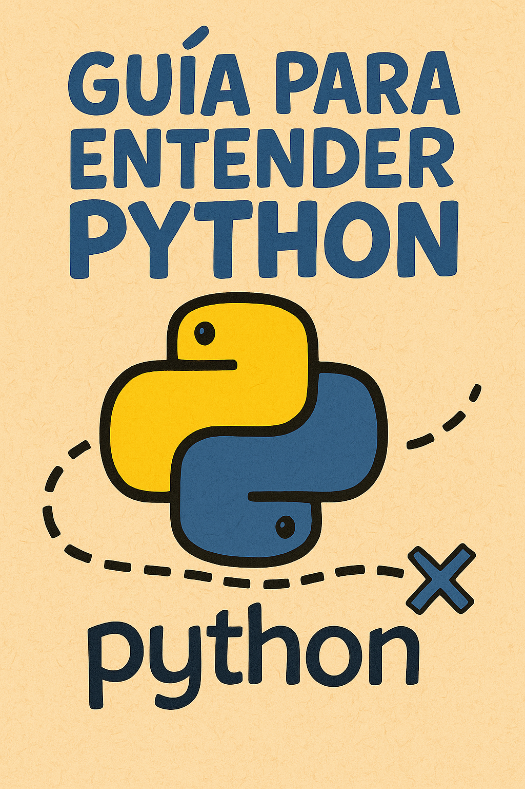

# 📓 Notebooks Interactivos - Curso Python



¡Bienvenido a los notebooks interactivos del curso! 🎉

## 🎯 ¿Qué son los Jupyter Notebooks?

Los Jupyter Notebooks son documentos interactivos que combinan:
- **Código ejecutable** que puedes correr paso a paso
- **Texto explicativo** con instrucciones claras
- **Resultados inmediatos** para ver qué hace tu código
- **Experimentación fácil** para probar variaciones

## 📚 Notebooks Disponibles

### 🚀 Nivel Principiante
1. **01-primer-programa.ipynb** - Tu primera experiencia con Python
   - Función `print()`
   - Comentarios
   - Ejercicios básicos
   - Arte ASCII

2. **02-variables-tipos-datos.ipynb** - Almacenando información
   - Variables básicas
   - Tipos de datos (string, int, float, bool)
   - Conversiones
   - Ejercicios prácticos

3. **ejercicios-practicos.ipynb** - ¡Hora de practicar!
   - Ejercicios guiados
   - Diferentes niveles de dificultad
   - Proyectos mini

### 🎯 Próximamente
- Control de flujo (if/else)
- Bucles (for/while)
- Listas y diccionarios
- Funciones
- Proyectos integradores

## 🛠️ Cómo Usar los Notebooks

### Opción 1: VS Code (Recomendado)
1. **Instala la extensión Python** en VS Code
2. **Abre el archivo .ipynb** directamente
3. **Ejecuta las celdas** con Shift+Enter
4. **Experimenta** cambiando el código

### Opción 2: Jupyter Lab/Notebook
```bash
# Instalar Jupyter
pip install jupyter

# Ejecutar Jupyter
jupyter notebook

# O Jupyter Lab (interfaz más moderna)
pip install jupyterlab
jupyter lab
```

### Opción 3: Online (Sin Instalación)
- **Google Colab**: https://colab.research.google.com
- **Repl.it**: https://replit.com
- **Binder**: https://mybinder.org

## 🎮 Instrucciones de Uso

### 📱 Navegación Básica
- **Ejecutar celda**: Shift + Enter
- **Nueva celda**: Alt + Enter  
- **Modo edición**: Enter
- **Modo navegación**: Esc

### 🔧 Tipos de Celdas
- **Code**: Para escribir código Python
- **Markdown**: Para texto explicativo
- **Raw**: Para texto sin formato

### 💡 Consejos de Uso
1. **Lee las instrucciones** antes de ejecutar código
2. **Ejecuta las celdas en orden** para mejores resultados
3. **Experimenta** cambiando valores y viendo qué pasa
4. **No tengas miedo de los errores** - son parte del aprendizaje
5. **Guarda frecuentemente** tu progreso (Ctrl+S)

## 🎯 Plan de Estudio Sugerido

### Semana 1: Fundamentos
- [ ] Notebook 1: Primer programa
- [ ] Notebook 2: Variables
- [ ] Ejercicios prácticos básicos

### Semana 2: Control y Estructura
- [ ] Condicionales
- [ ] Bucles
- [ ] Ejercicios intermedios

### Semana 3: Datos y Funciones
- [ ] Listas y diccionarios
- [ ] Funciones básicas
- [ ] Proyecto integrador

## 🔍 Solución de Problemas

### El notebook no se abre
**Solución**: Instala la extensión Python en VS Code
```bash
# O instala Jupyter
pip install jupyter notebook
```

### No puedo ejecutar las celdas
**Solución**: Verifica que tengas Python instalado
```bash
python --version
```

### Errores en el código
**Solución**: ¡Es normal! Los errores son parte del aprendizaje:
1. Lee el mensaje de error
2. Verifica la sintaxis
3. Revisa las instrucciones
4. Experimenta con cambios pequeños

## 📖 Recursos Adicionales

### Documentación
- [Jupyter Documentation](https://jupyter.org/documentation)
- [VS Code Python](https://code.visualstudio.com/docs/python/python-tutorial)

### Atajos Útiles
```text
Shift + Enter    → Ejecutar celda y avanzar
Ctrl + Enter     → Ejecutar celda sin avanzar  
Alt + Enter      → Ejecutar celda y crear nueva
A               → Insertar celda arriba
B               → Insertar celda abajo
DD              → Eliminar celda
M               → Convertir a Markdown
Y               → Convertir a Code
```

## 🎁 Ventajas de los Notebooks

✅ **Aprendizaje visual**: Ves resultados inmediatos  
✅ **Experimentación fácil**: Cambias código y pruebas al instante  
✅ **Documentación integrada**: Explicaciones junto al código  
✅ **Progreso paso a paso**: Avanzas a tu ritmo  
✅ **Reutilizable**: Puedes volver y practicar más tarde  

## 🤝 Consejos para el Éxito

1. **Practica regularmente**: 15-30 minutos diarios
2. **Experimenta**: Cambia valores y observa qué pasa
3. **Toma notas**: Añade tus propios comentarios
4. **Comparte**: Muestra tu progreso a amigos/familiares
5. **Diviértete**: ¡Python es divertido cuando juegas con él!

---

¡Disfruta aprendiendo Python de manera interactiva! 🐍✨

**Próximo paso**: Abre `01-primer-programa.ipynb` y ¡comienza tu aventura!
